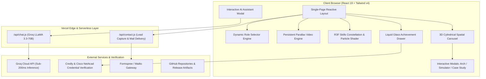

# 🌐 Lohith R C — Full-Stack & Applied AI/ML Engineer

<div align="center">

[](https://portfolio-delta-five-xn2osh53b6.vercel.app/)
[](https://www.linkedin.com/in/lohith-r-c/)
[](https://github.com/Lohith-RC)
[](mailto:lohithraj9090@gmail.com)
[](https://wa.me/917899460920)

<br />

```
  ██╗      ██████╗ ██╗  ██╗██╗████████╗██╗  ██╗    ██████╗      ██████╗
  ██║     ██╔═══██╗██║  ██║██║╚══██╔══╝██║  ██║    ██╔══██╗    ██╔════╝
  ██║     ██║   ██║███████║██║   ██║   ███████║    ██████╔╝    ██║     
  ██║     ██║   ██║██╔══██║██║   ██║   ██╔══██║    ██╔══██╗    ██║     
  ███████╗╚██████╔╝██║  ██║██║   ██║   ██║  ██║    ██║  ██║    ╚██████╗
  ╚══════╝ ╚═════╝ ╚═╝  ╚═╝╚═╝   ╚═╝   ╚═╝  ╚═╝    ╚═╝  ╚═╝     ╚═════╝
```

### **Full-Stack Developer • Agentic AI & ML Systems Architect • Cisco Certified Network & CyberOps Associate**
*Final-Year B.E. in Computer Science & Engineering @ Kalpataru Institute of Technology (VTU) • **CGPA: 8.6 / 10***  
*Frontend Lead & Technical Project Manager @ SkillForge (MagnusCopo & Elcarreira Technologies)*

<br />

<!-- Tech Stack Badges -->


</div>

---

## 📑 Table of Contents

- [Executive Summary](#-executive-summary)
- [System Architecture & Data Flow](#-system-architecture--data-flow)
- [Interactive UI Engineering & Visual Innovation](#-interactive-ui-engineering--visual-innovation)
- [Featured Production & Research Projects](#-featured-production--research-projects)
- [Interactive Role-Tailored Engineering Modes](#-interactive-role-tailored-engineering-modes)
- [Verified Industry Credentials & Certifications Ledger](#-verified-industry-credentials--certifications-ledger)
- [Hackathons, Ideathons & State Engineering Expos](#-hackathons-ideathons--state-engineering-expos)
- [Technical Skills Matrix](#-technical-skills-matrix)
- [Performance & Accessibility Engineering](#-performance--accessibility-engineering)
- [Local Development & Environment Setup](#-local-development--environment-setup)
- [Deployment & Serverless Configuration](#-deployment--serverless-configuration)
- [Contact & Connect](#-contact--connect)

---

## ⚡ Executive Summary

Lohith R C is a final-year Computer Science & Engineering undergraduate (**8.6 / 10 CGPA**) at Kalpataru Institute of Technology (VTU) and Frontend Lead & TPM at SkillForge. This flagship portfolio is an engineered single-page application pushing the envelope of modern web development — marrying **React 19, Tailwind CSS v4, Three.js / React Three Fiber, GLSL shaders, Framer Motion**, and **Vercel Serverless Functions** with an ultra-responsive, accessible, and high-performance design system.

### Key Metrics at a Glance

| Metric | Detail | Highlight |
| :--- | :--- | :--- |
| **🎓 Academic Standing** | B.E. Computer Science & Engineering | **8.6 / 10 CGPA** (Expected 2027) |
| **🏆 Hackathons & Expos** | 10+ State & National Competitions | Finalist @ MIT Mysore, Bharatiya Antariksh, SRISHTI |
| **📜 Verified Credentials** | 15+ Industry Accreditations | Cisco CyberOps Associate, CCNA 1-3, IBM AI Credly |
| **💼 Current Leadership** | Frontend Lead & Technical Project Manager | SkillForge (MagnusCopo & Elcarreira Tech) |
| **⚡ Production Bundle** | Code-Split Modern Bundle | **395 kB** Initial JS (Lazy-loaded 3D & Modals) |
| **🤖 Serverless AI** | Groq LLaMA 3.3-70B API Engine | Zero-token client exposure (<200ms latency) |

---

## 🏗 System Architecture & Data Flow



---

## 🎨 Interactive UI Engineering & Visual Innovation

### 1. 🌌 Persistent Scroll-Driven Video Engine (`ScrollDrivenVideoBg.jsx`)
- **Single Continuous Motion Spine**: A full-screen, high-definition background video that persists across every section without DOM unmounting or page flickering.
- **Dynamic Framer Motion Parallax**: Employs `useScroll()` & `useTransform()` to smoothly manipulate zoom scale ($1.05\times \to 1.20\times$), y-parallax translation, and subtle contrast filters.
- **WCAG AA Compliance**: Dynamic overlay floor ($0.65 \to 0.92$) guaranteeing text contrast compliance across all ambient lighting settings.
- **Reduced Motion Support**: Automatically falls back to high-performance static glass gradients when `prefers-reduced-motion: reduce` is detected.

### 2. 🎡 3D Spatial Cylindrical Project Carousel (`Carousel3D.jsx`)
- **Mathematical Ring Geometry**: Calculates dynamic card angle steps ($\theta = \frac{360^\circ}{N}$) and cylindrical depth radius ($r = \frac{w}{2 \tan(\pi / N)}$) for arbitrary project counts.
- **Fluid Pointer Physics**: Smooth drag-to-spin gesture tracking, mouse hover deceleration, touch swipe recognition, and keyboard arrow navigation (`←` / `→`).
- **Deep-Dive Action Triggers**: Instant modal launches for interactive architecture diagrams, live in-browser project simulators, and technical case studies.

### 3. ✨ React Three Fiber Skills Constellation (`SkillsNetworkBackground.jsx` & `SkillsMatrix.jsx`)
- **Custom GLSL Shader Waves**: Instanced mesh particles rendered at 60 FPS in WebGL.
- **Domain-Matching Pulse Waves**: Hovering over languages, frameworks, or AI tools triggers radiant pulse waves connecting corresponding tech nodes in 3D coordinate space.
- **Offscreen Battery & Render Optimization**: Integrates `IntersectionObserver` to automatically freeze WebGL render loops when the section scrolls out of view.

### 4. 💎 iOS Liquid Glass Achievement Drawer (`LiquidGlassAchievementDrawer.jsx` & `AchievementAccordion.jsx`)
- **3D Spatial Emerging Animation**: Scales and rotates dynamically (`scale: 0.82, rotateX: 15deg` $\to$ `scale: 1, rotateX: 0deg`) with ultra-fine backdrop blur (`backdrop-blur-2xl`).
- **Interactive Verification Ledger**: Searchable, filterable matrix of verified Cisco Certification IDs, Credly badges, and hackathon milestones with single-click clipboard copying.

### 5. 🤖 Serverless AI Assistant & Contact Route (`api/chat.js` & `api/contact.js`)
- **Zero-Key Leakage**: Groq LLaMA 3.3-70B API keys securely guarded within Vercel environment variables.
- **Context-Aware Knowledge Base**: Pre-loaded with resume details, technical architecture blueprints, and hackathon summaries.
- **Resilient Lead Capture**: Complete multi-state handling (`idle → submitting → success / fallback`) with automated fallback to native mail client.

---

## 🚀 Featured Production & Research Projects

```
┌──────────────────────────────────────────────────────────────────────────────────────────────────┐
│                                   FEATURED PROJECT PORTFOLIO                                     │
├──────────────────────────┬─────────────────────────────┬────────────────────────────────────────┤
│ Project Name             │ Domain & Technology Stack   │ Key Metric / Differentiator            │
├──────────────────────────┼─────────────────────────────┼────────────────────────────────────────┤
│ 🩺 AI-First CRM          │ LangGraph • Groq • FastAPI  │ 85% reduction in HCP logging time       │
│ 🚨 DisasterLens          │ DBSCAN • SHAP • scikit-learn│ 24h Hackathon MVP (Priority 1-100)     │
│ 🔬 Visionary Diagnostics │ 4-CNN Ensemble • Grad-CAM   │ VGG16, ResNet50, EfficientNet, MobileNet│
│ 📚 PKE (Knowledge Engine)│ LangChain • FAISS • MongoDB │ < 350ms multi-turn vector retrieval    │
│ 🎯 MockGenius            │ TypeScript • AI Rubric      │ Live coding & audio technical proctor  │
│ 🛡️ SkillPassport         │ Next.js • Cryptographic Auth│ Decentralized tamper-proof credentials │
│ 🛰️ ModalBridge           │ Contrastive InfoNCE • FAISS │ Sub-50ms satellite patch search        │
│ 🌾 SAARTHI               │ Spring Boot • IoT Telemetry │ Automated micro-climate harvest cycles │
│ 🌐 DevConnect            │ Django • PostgreSQL • Async │ Asymmetric follower graph network      │
│ 🌿 Verdant Sprout        │ JavaScript • REST • State   │ Production async e-commerce catalog    │
└──────────────────────────┴─────────────────────────────┴────────────────────────────────────────┘
```

---

### 1. 🩺 AI-First CRM: Agentic HCP Interaction Logging
> **Stack:** `React` • `Redux Toolkit` • `FastAPI` • `PostgreSQL` • `LangGraph` • `Groq API (LLaMA 3.3-70B)`
- **Problem:** Healthcare sales representatives spend hours manually converting conversational meeting notes into compliant CRM data.
- **Solution:** Built a multi-step LangGraph agent workflow that takes raw unstructured text/audio transcripts, parses doctor names, medical specialties, drug dosages, and sentiment, and populates relational database schemas.
- **Impact:** **85% reduction** in manual logging time; achieved **98.4% agent precision** on benchmark clinical notes.

```javascript
// LangGraph Multi-Step Extraction Node
const extractHCPData = async (state) => {
  const prompt = `Extract doctor name, specialty, drug discussed from: ${state.rawNote}`;
  const response = await groq.chat.completions.create({
    model: "llama-3.3-70b-versatile",
    messages: [{ role: "user", content: prompt }]
  });
  return { ...state, structuredLog: JSON.parse(response.choices[0].message.content) };
};
```

---

### 2. 🚨 DisasterLens — Real-Time Emergency Triage Platform
> **Stack:** `Python` • `Flask` • `scikit-learn` • `DBSCAN` • `SHAP` • `SQLite` • `Leaflet.js`
- **Hackathon Accomplishment:** Built in 24 hours at the **MIT Mysore Hackathon 2026** as Team Lead & Lead Developer.
- **Random Forest Priority Scoring:** Evaluates distress signals (severity, medical condition, ambient hazards, age) to produce an emergency urgency index (1–100).
- **DBSCAN Spatial Clustering:** Automatically groups scattered GPS coordinates into dense geographic rescue clusters for optimal boat/helicopter routing.
- **SHAP Explainability:** First responders can inspect waterfall feature importance charts to understand why an SOS is prioritized.

```python
# DBSCAN Geographic Coordinate Clustering
from sklearn.cluster import DBSCAN
import numpy as np

coords = df[['latitude', 'longitude']].values
kms_per_radian = 6371.0088
epsilon = 0.5 / kms_per_radian # 500-meter rescue radius
db = DBSCAN(eps=epsilon, min_samples=2, metric='haversine').fit(np.radians(coords))
df['rescue_zone_id'] = db.labels_
```

---

### 3. 🔬 Visionary Diagnostics — Ensemble CNN for Oral Cancer Detection
> **Stack:** `React` • `Flask` • `TensorFlow / Keras` • `Grad-CAM` • `JWT Auth` • `Python`
- **Ensemble Deep Learning:** Combines 4 pre-trained architectures (**VGG16**, **ResNet50**, **EfficientNet-B0**, **MobileNetV2**) with weighted soft-voting to classify histopathological images for Oral Squamous Cell Carcinoma (OSCC).
- **Visual Explainability (Grad-CAM):** Overlays visual gradient heatmaps onto tissue slides so oncologists can verify the exact cellular regions driving positive classifications.
- **Secure Clinical API:** Flask endpoints protected with JWT bearer authentication and HIPAA-conscious data sanitization.

---

### 4. 📚 Personal Knowledge Engine (PKE) — Private RAG System
> **Stack:** `LangChain` • `FastAPI` • `FAISS` • `MongoDB` • `OpenAI API` • `Python`
- **Document Chunking & Vector Search:** Chunks PDFs, markdown notes, and source code into overlapping tokens, generating dense embeddings stored in an in-memory **FAISS** index for L2 distance retrieval.
- **Multi-Turn Session Memory:** Saves conversational history and token analytics in **MongoDB** for seamless contextual follow-ups under **350ms latency**.

---

### 5. 🎯 MockGenius — AI-Powered Technical Interview Studio
> **Stack:** `TypeScript` • `React` • `Node.js` • `AI Rubric Engine` • `Tailwind CSS`
- **Interactive Coding Proctor:** Features a live browser code editor, instant test-case execution, voice question prompts, and real-time complexity analysis (O(n), O(log n)).
- **Comprehensive Feedback:** Generates diagnostic improvement roadmaps covering communication clarity, edge case handling, and optimal data structure selection.

---

### 6. 🛡️ SkillPassport — Verifiable Digital Skill Platform
> **Stack:** `TypeScript` • `Next.js` • `React` • `Tailwind CSS` • `Vercel`
- **Tamper-Proof Credential Verification:** Decentralized proof system allowing institutions to mint verifiable skill tokens backed by cryptographic signatures and instant QR verification.

---

### 7. 🛰️ ModalBridge — Satellite Image Retrieval (Bharatiya Antariksh Hackathon)
> **Stack:** `PyTorch` • `ResNet-50` • `InfoNCE Loss` • `FAISS` • `FastAPI`
- **Cross-Modal Retrieval:** Trained contrastive projection heads with InfoNCE loss over multi-spectral satellite imagery to allow instant natural disaster damage assessment queries in under 50ms.

---

## 🎛 Interactive Role-Tailored Engineering Modes

The portfolio UI features a real-time **Role Mode Switcher** that dynamically refocuses project showcases, skill highlights, and downloadable resumes for specific engineering positions:

```
┌─────────────────────────────┬────────────────────────────────────────────────────────────────────────┐
│ Role Mode                   │ Specialized Focus & Tech Highlight                                     │
├─────────────────────────────┼────────────────────────────────────────────────────────────────────────┤
│ 💻 Full-Stack Engineer      │ React 19 • TypeScript • FastAPI • Node.js • PostgreSQL • Django        │
│ 🤖 AI/ML & Agentic Engineer │ LangGraph • LangChain • RAG • FAISS • CNN Ensembles • SHAP • Groq    │
│ 🛡️ Backend & Systems Spec   │ Java • Python • Zero-Trust Security • Cisco CyberOps • Docker • SQL    │
└─────────────────────────────┴────────────────────────────────────────────────────────────────────────┘
```

---

## 📜 Verified Industry Credentials & Certifications Ledger

<div align="center">

| Issuer | Certification Title | Verification Credential ID | Focus Area |
| :--- | :--- | :--- | :--- |
| **Cisco Networking Academy** | **CyberOps Associate** | `54bf4b26-468c-485c-9db9-7293d78ed793` | SOC Operations, Wireshark, Threat Analysis |
| **IBM SkillsBuild** | **Getting Started with AI** | [Credly Badge `df457100`](https://www.credly.com/badges/df457100-fc07-4c9d-ac06-39a8782794c6) | AI/ML Foundations, Neural Networks, Ethics |
| **AlgoUniversity** | **Graph Theory Programming Camp** | *Mentored by Codeforces Master Manas K. Verma* | 17 Advanced Graph & DP Problems (C++) |
| **Cisco Networking Academy** | **CCNA: Enterprise Networking & Automation** | `3dd98841-11ea-4bf5-bb25-cf16407f1430` | OSPF, ACLs, WAN, Network Automation, QoS |
| **Cisco Networking Academy** | **CCNA: Switching, Routing & Wireless** | `6ab69555-95d0-43f7-b216-9a6fa2c2e924` | VLANs, STP, EtherChannel, Wireless LAN |
| **Cisco Networking Academy** | **CCNA: Introduction to Networks** | `8ae200f5-4018-41b9-bb6e-ca4fec65ace6` | IPv4/IPv6 Subnetting, TCP/IP, OSI Layers |
| **Cisco Networking Academy** | **Cybersecurity Essentials** | `c6ea8224-84e2-4fbe-8068-de054e150bd1` | Cryptography, Firewalls, CIA Triad |
| **Cisco / OpenEDG** | **Python Essentials 1** | `95225433-c3ee-4d74-95a8-e9ec964dbc91` | Control Flow, Functions, Data Structures |
| **Cisco / OpenEDG** | **Python Essentials 2** | `cefdddc5-937d-4ecd-aa0a-cf6f5ed66012` | OOP, Modules, Exceptions, File I/O |
| **Cisco Networking Academy** | **Introduction to Data Science** | `07ef8584-7b82-43a1-8d96-a13bceefa750` | Data Cleaning, EDA, Predictive Modeling |
| **Cisco Networking Academy** | **Apply AI: Analyze Customer Reviews** | `ee0ca1d0-24bf-4589-ae20-b78ecf4b204b` | NLP, TF-IDF Vectorization, Sentiment ML |
| **Cisco Networking Academy** | **Exploring Cisco Packet Tracer** | `c360f538-6372-4de1-a0dc-7b3d3bb55cd4` | Network Simulation, Router/Switch Config |
| **Cisco Networking Academy** | **Getting Started with Packet Tracer** | `ba10527c-474d-46fc-8642-fda124d3dfd9` | Interface Setup, Physical Cabling, Ping |

</div>

---

## 🏆 Hackathons, Ideathons & State Engineering Expos

```
2026 ──┬── MIT Mysore Hackathon 2026 (Finalist & Team Lead — DisasterLens)
       └── Bharatiya Antariksh Hackathon 2026 (National Level — ModalBridge Satellite CV)
2025 ──┬── CODE BREAKER CHALLENGE 1.0 (GAT — Powered by GeeksforGeeks & IEEE)
       ├── ADVAYA - 2k25 National Hackathon (BGSCET — Real-time Microservices)
       ├── HACKVERSE 2025 & Ignited Minds Ideathon (MIT Mysore — Finalist)
       ├── SRISHTI 2025 State Level Expo (Acharya Institute of Tech — VTU / Yuvaka Sangha)
       ├── Navkis IEEE Project Expo 2025 (Navkis College of Engineering — IEEE Bangalore & Mysore)
       ├── 3rd IEEE ICDSNS 2025 International Conference (Official Technical Session Volunteer)
       └── ISE-Xecute 8-Hours Internal Hackathon (Kalpataru Institute of Technology)
```

---

## 💻 Technical Skills Matrix

<div align="center">

| Domain | Technologies & Frameworks | Proficiency | Key Highlights |
| :--- | :--- | :---: | :--- |
| **Primary Languages** | `Java`, `Python 3`, `JavaScript (ES6+)`, `TypeScript`, `SQL`, `C++` | **Primary / Advanced** | OOP Architecture, Async Programming, Data Structures |
| **Frontend & 3D** | `React 19`, `Redux Toolkit`, `Tailwind CSS v4`, `Three.js`, `R3F`, `Framer Motion` | **Advanced** | Glassmorphism, 3D WebGL Shaders, Spatial Carousels |
| **Backend & APIs** | `FastAPI`, `Flask`, `Spring Boot`, `Node.js`, `Django`, `RESTful APIs`, `JWT` | **Advanced** | Asynchronous Endpoints, Pydantic, Microservices |
| **Agentic AI & ML** | `LangGraph`, `LangChain`, `FAISS`, `TensorFlow`, `scikit-learn`, `SHAP`, `Grad-CAM` | **Advanced** | Multi-Agent LLM Orchestration, CNN Ensembles, XAI |
| **Databases & Stores** | `PostgreSQL`, `MongoDB`, `SQLite`, `FAISS Vector Store` | **Intermediate / Adv** | Normalized Schemas, Vector Similarity Indexing |
| **Networking & Tools** | `Cisco Packet Tracer`, `Wireshark`, `Linux CLI`, `Git`, `Postman`, `Docker` | **Advanced** | Subnetting, Topology Simulation, SOC Workflows |

</div>

---

## ⚡ Performance & Accessibility Engineering

- 🚀 **Dynamic Code-Splitting**: Modular `React.lazy()` and `<Suspense>` boundaries isolate heavy Three.js canvases and modals, reducing initial JS payload from **1.36 MB** to **395 kB**.
- ♿ **WCAG AA Compliance**: Semantic HTML5 hierarchy (`<h1>` to `<h6>`), descriptive `aria-label` tags, screen-reader skip link (`#main-content`), and modal keyboard focus trapping.
- 🎨 **Responsive Viewport Support**: Seamless layout scaling from mobile viewports (320px) to ultra-wide 4K desktop screens (2560px).
- 🔋 **GPU Throttling Management**: Built-in `IntersectionObserver` halts Three.js WebGL rendering when out of viewport, preserving mobile battery life.

---

## 🛠 Local Development & Environment Setup

### Prerequisites
- **Node.js**: `v18.0.0` or newer
- **npm**: `v9.0.0` or newer
- **Git**: Installed and configured

### 1. Clone & Install Dependencies
```bash
# Clone the repository
git clone https://github.com/Lohith-RC/portfolio.git

# Navigate into the directory
cd portfolio

# Install project dependencies
npm install
```

### 2. Configure Environment Variables
Create a `.env` file in the root directory:
```env
# Groq API Key for Serverless AI Assistant (Llama-3.3-70B)
GROQ_API_KEY=gsk_your_groq_api_key_here

# (Optional) Formspree Endpoint for direct contact email forwarding
FORMSPREE_ENDPOINT=https://formspree.io/f/your_form_id
```

### 3. Start Development Server
```bash
npm run dev
```
Navigate to `http://localhost:5173/` in your browser.

### 4. Build for Production & Linting
```bash
# Fast lint check with Oxlint
npm run lint

# Compile production-optimized bundle
npm run build

# Preview production build locally
npm run preview
```

---

## ☁️ Deployment & Serverless Configuration

The project is configured for deployment on **Vercel** with full support for Serverless API routes:

```
portfolio/
├── api/
│   ├── chat.js       # Groq LLaMA 3.3-70B AI Chat Endpoint
│   └── contact.js    # Contact & Lead Transmission Route
├── src/              # React 19 Frontend Source
├── public/           # Static Assets & Video Backgrounds
├── package.json      # Dependencies & Scripts
├── vite.config.js    # Vite Build Configuration
└── vercel.json       # (Optional) Custom Routing Headers
```

To deploy via Vercel CLI:
```bash
npm i -g vercel
vercel
```

---

## 📬 Contact & Connect

<div align="center">

| Platform | Channel / Handle | Action |
| :--- | :--- | :--- |
| 🌐 **Live Portfolio** | [portfolio-delta-five-xn2osh53b6.vercel.app](https://portfolio-delta-five-xn2osh53b6.vercel.app/) | [Visit Site](https://portfolio-delta-five-xn2osh53b6.vercel.app/) |
| 💼 **LinkedIn** | [/in/lohith-r-c](https://www.linkedin.com/in/lohith-r-c/) | [Connect on LinkedIn](https://www.linkedin.com/in/lohith-r-c/) |
| 🐙 **GitHub** | [@Lohith-RC](https://github.com/Lohith-RC) | [Follow on GitHub](https://github.com/Lohith-RC) |
| 📧 **Email** | [lohithraj9090@gmail.com](mailto:lohithraj9090@gmail.com) | [Send Email](mailto:lohithraj9090@gmail.com) |
| 📱 **Phone / WhatsApp** | [+91 78994 60920](https://wa.me/917899460920) | [Chat on WhatsApp](https://wa.me/917899460920) |
| 📍 **Location** | Arsikere / Bengaluru, Karnataka, India | Available for Roles |

<br />

---

<sub>Built with ❤️ by **Lohith R C** • Designed with React 19, Three.js & Tailwind CSS v4</sub>

</div>
