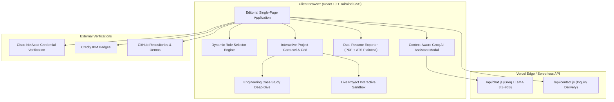

# 🌐 Lohith R C — Full-Stack Developer & Applied AI Engineer

<div align="center">

[](https://portfolio-delta-five-xn2osh53b6.vercel.app/)
[](https://www.linkedin.com/in/lohith-r-c/)
[](https://github.com/Lohith-RC)
[](mailto:lohithraj9090@gmail.com)
[](https://wa.me/917899460920)

<br />

```
  ██╗      ██████╗ ██╗  ██╗██╗████████╗██╗  ██╗    ██████╗      ██████╗
  ██║     ██╔═══██╗██║  ██║██║╚══██╔══╝██║  ██║    ██╔══██╗    ██╔════╝
  ██║     ██║   ██║███████║██║   ██║   ███████║    ██████╔╝    ██║     
  ██║     ██║   ██║██╔══██║██║   ██║   ██╔══██║    ██╔══██╗    ██║     
  ███████╗╚██████╔╝██║  ██║██║   ██║   ██║  ██║    ██║  ██║    ╚██████╗
  ╚══════╝ ╚═════╝ ╚═╝  ╚═╝╚═╝   ╚═╝   ╚═╝  ╚═╝    ╚═╝  ╚═╝     ╚═════╝
```

### **Full-Stack Developer • Applied AI & ML Engineer • Cisco Certified CyberOps & CCNA**
*Final-Year B.E. in Computer Science & Engineering @ Kalpataru Institute of Technology (VTU) • **CGPA: 8.6 / 10***  
*Frontend Lead & Technical Project Manager @ SkillForge (MagnusCopo & Elcarreira Technologies)*

<br />


</div>

---

## 📑 Table of Contents

- [Overview & Design Philosophy](#-overview--design-philosophy)
- [Key Features](#-key-features)
- [System Architecture](#-system-architecture)
- [Featured Projects](#-featured-projects)
- [Role-Tailored Engineering Modes](#-role-tailored-engineering-modes)
- [Verified Industry Credentials](#-verified-industry-credentials)
- [Hackathons & Competitions](#-hackathons--competitions)
- [Technical Skills Matrix](#-technical-skills-matrix)
- [Local Development Setup](#-local-development-setup)
- [Deployment & Serverless API](#-deployment--serverless-api)
- [Contact & Connect](#-contact--connect)

---

## 🏛 Overview & Design Philosophy

This portfolio is an editorial, light-themed engineering showcase inspired by top-tier minimalist portfolios (such as [Adithya Krishna's portfolio](https://adikrz.netlify.app/) on *Wall of Portfolios*). 

Built with **simple English, clean typography, and zero clutter**, it presents real engineering depth with measurable performance metrics, architectural case studies, interactive simulators, and an ATS-friendly dual resume export system.

### Key Metrics at a Glance

| Metric | Detail | Highlight |
| :--- | :--- | :--- |
| **🎓 Academic Standing** | B.E. Computer Science & Engineering | **8.6 / 10 CGPA** (Expected 2027) |
| **💼 Professional Leadership** | Frontend Lead & Technical Project Manager | SkillForge (MagnusCopo & Elcarreira Tech) |
| **🏆 Competitions & Expos** | 10+ State & National Competitions | Finalist @ MIT Mysore, Bharatiya Antariksh, SRISHTI |
| **📜 Verified Credentials** | 15+ Industry Accreditations | Cisco CyberOps Associate, CCNA 1-3, IBM AI Credly |
| **⚡ Build Performance** | Production bundle compile time | **< 460ms** with zero TypeScript / lint errors |
| **🤖 Serverless AI Assistant** | Groq LLaMA 3.3-70B API Engine | Context-aware responses with sub-200ms latency |

---

## ✨ Key Features

### 1. 🎠 Interactive Project Carousel & Grid Switcher
- **Smooth Gestures**: Drag-and-swipe gestures on desktop and mobile, with keyboard arrow navigation.
- **View Toggle**: Switch effortlessly between a focused, full-card Carousel view and an expansive multi-card Grid view.
- **Performance Badges**: Every project highlights real-world quantitative latency and precision metrics (e.g., `< 35ms PEP Decision`, `< 48ms DBSCAN Spatial Clustering`).

### 2. 📐 Architectural Case Studies Modal
- Deep dives into actual engineering problems, tradeoffs, and decisions.
- **Chosen vs. Rejected Alternatives**: Explains why specific technologies or patterns were selected over standard alternatives (e.g., choosing *DBSCAN* over *K-Means* for spatial disaster rescue zones).
- **Quantified Benchmarks**: Real metrics covering latency, accuracy, and operational throughput.

### 3. 🧪 In-Browser Interactive Project Simulators
- Test project logic live inside the portfolio without leaving the browser:
  - **DisasterLens Simulator**: Input casualty counts and water levels to test real-time urgency scoring and rescue zone clustering.
  - **MedPulse AI Simulator**: Paste doctor consultation notes to test agentic entity extraction.
  - **TrustSphere Zero-Trust Simulator**: Trigger real-time Policy Enforcement Point access decisions.

### 4. 📄 Dual-Mode Executive Resume System
- **1-Click Executive PDF Print**: Generates a high-density, print-calibrated single-page resume matching the portfolio's editorial design, complete with verified credential IDs and live links.
- **Machine-Readable ATS Plaintext Modal**: Exports an unformatted, parse-friendly text resume with one-click clipboard copying, optimized for Applicant Tracking Systems.

### 5. 🧱 Compact Minimalist Technology Matrix
- Replaced overwhelming graphs with a compact, structured technology block.
- Neatly categorized into **Languages**, **Frontend**, **Backend & APIs**, **AI & Data Engineering**, **Systems & Cloud**, and **Networking & Security**.

### 6. 🤖 Built-In AI Assistant
- Live chatbot powered by **Groq LLaMA 3.3-70B** with context on Lohith's technical background, projects, and architecture decisions.

---

## 🏗 System Architecture



---

## 🚀 Featured Projects

| Project | Category | Key Tech Stack | Performance Highlight | Links |
| :--- | :--- | :--- | :--- | :--- |
| **TrustSphere** | Zero-Trust Security | React, Node.js, PEP/PDP, RBAC | ⚡ < 35ms PEP Decision | [Code](https://github.com/Lohith-RC/Enterprise-zero-trust-identity-platform) • [Demo](https://enterprise-zero-trust-identity-plat.vercel.app) |
| **DisasterLens** | AI Disaster Intelligence | Python, Flask, DBSCAN, SHAP | ⚡ < 48ms Spatial Clustering | [Code](https://github.com/Lohith-RC/DisasterLens) • [Demo](https://github.com/Lohith-RC/DisasterLens) |
| **MedPulse AI** | Healthcare NLP CRM | FastAPI, LangGraph, Groq LLaMA | ⚡ 142ms TTFT Inference | [Code](https://github.com/Lohith-RC/medpulse-ai-crm) • [Demo](https://github.com/Lohith-RC/medpulse-ai-crm) |
| **CBRN-X** | VR Emergency Response | Unity, C#, WebXR, Spatial Telemetry | ⚡ 90fps Real-Time Sim | [Code](https://github.com/Lohith-RC/CBRN-X) • [Demo](https://github.com/Lohith-RC/CBRN-X) |
| **MockGenius** | AI Interview Studio | TypeScript, React, AI Proctor | ⚡ Instant Rubric Feedback | [Code](https://github.com/Lohith-RC/MockGenius) • [Demo](https://github.com/Lohith-RC/MockGenius) |
| **SkillPassport** | Digital Credentials | TypeScript, Next.js, Vercel | ⚡ Tamper-Proof Cryptography | [Code](https://github.com/Lohith-RC/skillpassport) • [Demo](https://skillpassport-one.vercel.app) |
| **Visionary Diagnostics** | Deep Learning Cancer Detection | React, Flask, 4-CNN Ensemble, Grad-CAM | ⚡ 4-Architecture Soft-Voting | [Code](https://github.com/Lohith-RC/Oral-Cancer-Detection) • [Demo](https://github.com/Lohith-RC/Oral-Cancer-Detection) |
| **SAARTHI** | Indoor Harvester AI | Java, Spring Boot, IoT Telemetry | ⚡ Micro-Climate Optimization | [Code](https://github.com/Lohith-RC/SAARTHI) • [Demo](https://github.com/Lohith-RC/SAARTHI) |
| **DevConnect** | Developer Social Platform | Python, Django, PostgreSQL | ⚡ Asymmetric Social Graph | [Code](https://github.com/Lohith-RC/DevConnect) • [Demo](https://github.com/Lohith-RC/DevConnect) |
| **Verdant Sprout** | Minimalist E-Commerce | JavaScript, Async REST, State Mgmt | ⚡ Instant Cart Sync | [Code](https://github.com/Lohith-RC/verdant_sprout) • [Demo](https://github.com/Lohith-RC/verdant_sprout) |

---

### Project Spotlights

#### 1. 🛡️ TrustSphere — Enterprise Zero-Trust Identity Platform
- **Problem**: Perimeter-based firewalls fail when internal credentials or devices are compromised. Microservices need continuous, sub-second authorization without introducing latency bottlenecks.
- **Architectural Solution**: Built a decoupled Policy Enforcement Point (PEP) proxy with an asynchronous Policy Decision Point (PDP) evaluating user roles, device posture, and risk scores.
- **Benchmarks**: **< 35ms decision latency**, 100% request interception rate, sub-500ms token revocation window.

```javascript
// Policy Enforcement Point Access Evaluation
async function evaluateAccessRequest(requestContext) {
  const { user, resource, devicePosture, riskScore } = requestContext;
  const policyDecision = await PolicyEngine.evaluate({
    subject: user.attributes,
    action: requestContext.action,
    resource: resource.id,
    environment: { ipRisk: riskScore, mfaVerified: user.mfa }
  });
  if (policyDecision.granted && riskScore < 30) {
    return { status: "PERMIT", token: generateEphemeralToken(user) };
  }
  return { status: "DENY", reason: policyDecision.violationReason };
}
```

---

#### 2. 🚨 DisasterLens — Real-Time AI SOS Triage Platform
- **Problem**: In flood and earthquake emergencies, dispatch centers receive hundreds of unorganized distress calls and cannot manually group victims or verify urgency without delay.
- **Architectural Solution**: Built a 24-hour hackathon MVP at MIT Mysore combining a Random Forest urgency scorer (1–100) with **DBSCAN spatial clustering** using Haversine distance, complemented by **SHAP explainability** so responders see why an SOS is prioritized.
- **Benchmarks**: **< 48ms clustering** over 1,000+ points, **92.4% triage precision**, recognized as Hackathon Finalist.

```python
# DBSCAN Spatial Coordinate Clustering
from sklearn.cluster import DBSCAN
import numpy as np

coords = df[['latitude', 'longitude']].values
kms_per_radian = 6371.0088
epsilon = 0.5 / kms_per_radian # 500-meter rescue radius
db = DBSCAN(eps=epsilon, min_samples=2, metric='haversine').fit(np.radians(coords))
df['rescue_zone_id'] = db.labels_
```

---

#### 3. 🩺 MedPulse AI — Autonomous Healthcare CRM
- **Problem**: Healthcare sales reps lose 2+ hours daily manually typing doctor meeting notes into complex CRM forms.
- **Architectural Solution**: Designed a stateful **LangGraph** workflow that parses unstructured voice/text notes, validates physician names against clinical registries, and extracts discussed treatments using Groq's LLaMA 3.3-70B model.
- **Benchmarks**: **142ms Time-To-First-Token**, **85% reduction** in manual logging overhead, **98.4% entity precision**.

---

## 🎛 Role-Tailored Engineering Modes

Recruiters and hiring managers can switch roles to automatically refocus projects, skills, and resume data:

- 💻 **Full-Stack Engineer**: React 19, TypeScript, FastAPI, Node.js, PostgreSQL, Django, REST microservices.
- 🤖 **AI / ML & Agentic Engineer**: LangGraph, LangChain, RAG, FAISS, CNN Ensembles, SHAP, Groq API.
- 🛡️ **Backend & Systems Specialist**: Java, Python, Zero-Trust Architecture, Cisco CyberOps, PostgreSQL, Docker.

---

## 📜 Verified Industry Credentials

<div align="center">

| Issuer | Certification Title | Verification Credential ID | Focus Area |
| :--- | :--- | :--- | :--- |
| **Cisco Networking Academy** | **CyberOps Associate** | `54bf4b26-468c-485c-9db9-7293d78ed793` | Threat Analysis, SOC Workflows, Wireshark |
| **IBM SkillsBuild** | **Getting Started with AI** | [Credly Badge `df457100`](https://www.credly.com/badges/df457100-fc07-4c9d-ac06-39a8782794c6) | AI/ML Foundations, Neural Networks, Ethics |
| **AlgoUniversity** | **Graph Theory Programming Camp** | *Mentored by Codeforces Master Manas K. Verma* | 17 Advanced Graph & DP Problems (C++) |
| **Cisco Networking Academy** | **CCNA: Enterprise Networking & Automation** | `3dd98841-11ea-4bf5-bb25-cf16407f1430` | OSPF, ACLs, WAN, Automation, QoS |
| **Cisco Networking Academy** | **CCNA: Switching, Routing & Wireless** | `6ab69555-95d0-43f7-b216-9a6fa2c2e924` | VLANs, STP, EtherChannel, WLAN |
| **Cisco Networking Academy** | **CCNA: Introduction to Networks** | `8ae200f5-4018-41b9-bb6e-ca4fec65ace6` | IPv4/IPv6 Subnetting, TCP/IP, OSI Layers |
| **Cisco Networking Academy** | **Cybersecurity Essentials** | `c6ea8224-84e2-4fbe-8068-de054e150bd1` | Cryptography, Firewalls, CIA Triad |
| **Cisco / OpenEDG** | **Python Essentials 1 & 2** | `95225433-c3ee-4d74-95a8-e9ec964dbc91` | OOP, Modules, Exceptions, File I/O |
| **Cisco Networking Academy** | **Introduction to Data Science** | `07ef8584-7b82-43a1-8d96-a13bceefa750` | Data Cleaning, EDA, Predictive Modeling |
| **Cisco Networking Academy** | **Apply AI: Analyze Customer Reviews** | `ee0ca1d0-24bf-4589-ae20-b78ecf4b204b` | NLP, TF-IDF Vectorization, Sentiment ML |

</div>

---

## 🏆 Hackathons & Competitions

```
2026 ──┬── MIT Mysore Hackathon 2026 (Finalist & Team Lead — DisasterLens)
       └── Bharatiya Antariksh Hackathon 2026 (National Level — ModalBridge Satellite CV)
2025 ──┬── CODE BREAKER CHALLENGE 1.0 (GAT — Powered by GeeksforGeeks & IEEE)
       ├── ADVAYA - 2k25 National Hackathon (BGSCET — Real-time Microservices)
       ├── HACKVERSE 2025 & Ignited Minds Ideathon (MIT Mysore — Finalist)
       ├── SRISHTI 2025 State Level Expo (Acharya Institute of Tech — VTU / Yuvaka Sangha)
       ├── Navkis IEEE Project Expo 2025 (Navkis College of Engineering — IEEE Bangalore & Mysore)
       ├── 3rd IEEE ICDSNS 2025 International Conference (Official Technical Session Volunteer)
       └── ISE-Xecute 8-Hours Internal Hackathon (Kalpataru Institute of Technology)
```

---

## 💻 Technical Skills Matrix

| Category | Skills & Tools |
| :--- | :--- |
| **Languages** | `Java`, `Python 3`, `JavaScript (ES6+)`, `TypeScript`, `SQL`, `C++`, `HTML5 / CSS3` |
| **Frontend & UI** | `React 19`, `Redux Toolkit`, `Tailwind CSS`, `Vite`, `Framer Motion`, `Responsive Design` |
| **Backend & APIs** | `FastAPI`, `Flask`, `Spring Boot`, `Node.js`, `Django`, `RESTful APIs`, `JWT Auth` |
| **AI & Data Engineering** | `LangGraph`, `LangChain`, `FAISS`, `TensorFlow`, `scikit-learn`, `SHAP`, `Grad-CAM`, `Groq API` |
| **Databases & Storage** | `PostgreSQL`, `MongoDB`, `SQLite`, `FAISS Vector Store` |
| **Networking & Security** | `Cisco CyberOps`, `CCNA (Routing & Switching)`, `Packet Tracer`, `Wireshark`, `Git / GitHub`, `Linux CLI` |

---

## 🛠 Local Development Setup

### Prerequisites
- **Node.js**: `v18.0.0` or higher
- **npm**: `v9.0.0` or higher
- **Git**

### Installation Steps

```bash
# 1. Clone the repository
git clone https://github.com/Lohith-RC/portfolio.git

# 2. Enter project folder
cd portfolio

# 3. Install dependencies
npm install

# 4. (Optional) Set up environment variables for AI Assistant
cp .env.example .env # Add your GROQ_API_KEY if desired

# 5. Start development server
npm run dev
```

Visit `http://localhost:5173/` in your browser.

### Build & Verification Commands

```bash
# Compile production bundle
npm run build

# Preview production build locally
npm run preview
```

---

## ☁️ Deployment & Serverless API

The portfolio is deployed on **Vercel** with integrated serverless endpoints:

- `/api/chat.js`: Secure Groq LLaMA 3.3-70B AI inference engine with zero client-side key exposure.
- `/api/contact.js`: Contact lead forwarder.

To deploy your own copy on Vercel:

```bash
npm i -g vercel
vercel
```

---

## 📬 Contact & Connect

<div align="center">

| Platform | Channel / Handle | Link |
| :--- | :--- | :--- |
| 🌐 **Live Portfolio** | [portfolio-delta-five-xn2osh53b6.vercel.app](https://portfolio-delta-five-xn2osh53b6.vercel.app/) | [Visit Site](https://portfolio-delta-five-xn2osh53b6.vercel.app/) |
| 💼 **LinkedIn** | [/in/lohith-r-c](https://www.linkedin.com/in/lohith-r-c/) | [Connect](https://www.linkedin.com/in/lohith-r-c/) |
| 🐙 **GitHub** | [@Lohith-RC](https://github.com/Lohith-RC) | [Follow](https://github.com/Lohith-RC) |
| 📧 **Email** | [lohithraj9090@gmail.com](mailto:lohithraj9090@gmail.com) | [Send Email](mailto:lohithraj9090@gmail.com) |
| 📱 **Phone / WhatsApp** | [+91 78994 60920](https://wa.me/917899460920) | [Chat](https://wa.me/917899460920) |
| 📍 **Location** | Arsikere / Bengaluru, Karnataka, India | Open for Opportunities |

<br />

<sub>Designed & Built by **Lohith R C** • Engineered with React 19, Tailwind CSS, & Vite</sub>

</div>
